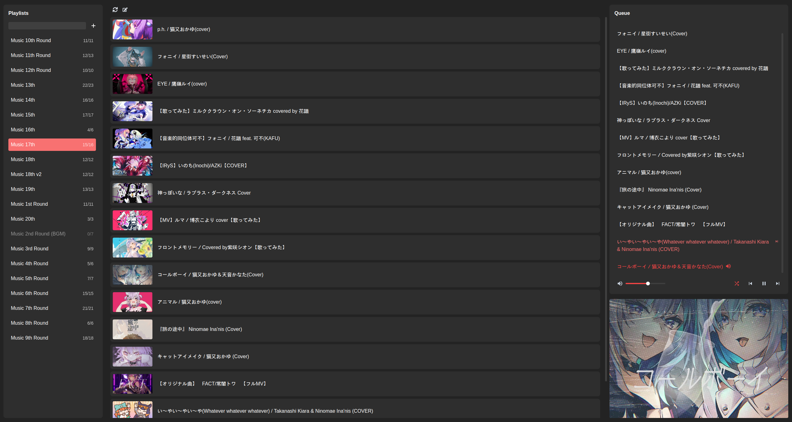

## Youtube Player

Desktop application that uses youtube-dl to download and play playlists/videos.

Note: code currently still contains old music player code that will be replaced to MPD controls in the future.
Some buttons might not work

Features:
  - [x] Download playlists from youtube
  - [ ] MPD Controls
    - [x] Play playlists to MPD server
    - [x] Toggle random
    - [ ] Show active playing music
    - [ ] Toggle repeat
    - [ ] Create playlists
    - [ ] Display duration/location of music
    - [ ] Seek
    - [ ] Play next queued music
    - [x] Queue / Play a selected music
    - [ ] Play / Pause
    - [ ] Set volume

### Install

Youtube-dl is required for this application to work

`pip install youtube-dl`

MPD server and MPC command is required to play the music

Download latest [release](https://github.com/myin142/yt-player/releases)

